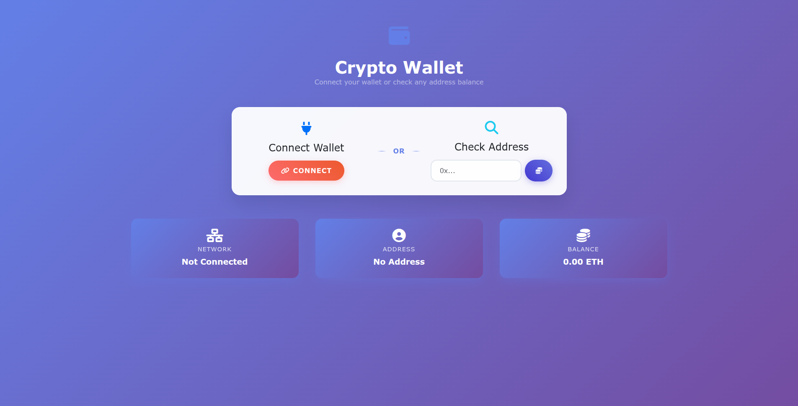

# 💳 Crypto Wallet DApp  

A simple and elegant **Ethereum Wallet Checker** built with **Vanilla JavaScript**, **Ethers.js**, and **Vite**.  
You can either **connect your wallet** or **check any address balance** easily.  

  

---

## 🚀 Features
- 🔗 **Connect Wallet** (MetaMask or any EIP-1193 provider)  
- 🏦 **Check balance of any Ethereum address**  
- 🌐 **Show current network**  
- 👤 **Show wallet address**  
- 💰 **Display ETH balance**  

---

## 📦 Installation

Clone the repository and install dependencies:
```bash
git clone https://github.com/Solthera/Ethereum-wallet-check.git
cd Ethereum-wallet-check
npm install
npm run dev